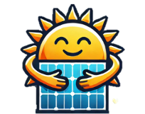
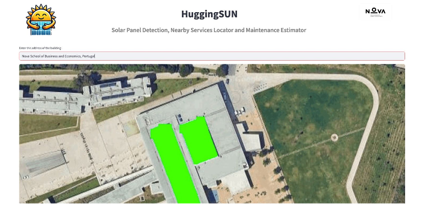

# HuggingSUN ☀️ — Solar Panel Detection & Services App

<p align="center">
  
</p>

> **Course:** Advanced Topics in Machine Learning | Nova School of Business & Economics
> **Type:** Group Project | **Team:** Group 2 TXA

---

## Overview

HuggingSUN is an end-to-end AI-powered web application that detects solar panels in satellite imagery using computer vision, estimates panel area and maintenance costs, and helps users locate nearby solar service providers. The project was built as a real-world business tool for a solar energy company to serve both existing clients (maintenance, cleaning) and new customers (installation quotes).

The application is built with **Streamlit** and powered by a fine-tuned **YOLOv8 segmentation model** trained on satellite imagery.

---

## Business Case

The application serves two customer segments:

- **Existing clients** — Enter your address to get an instant estimate of your solar panel area and expected annual maintenance cost
- **New customers** — Detect whether your roof has solar panels, get an installation area estimate, and find nearby solar service providers to contact directly through the app

---

## Features

- 🛰️ **Satellite image retrieval** — Fetches rooftop imagery via Google Maps Static API from any address
- ☀️ **Solar panel detection** — YOLOv8 segmentation model identifies and masks panel areas in the image
- 📐 **Area estimation** — Calculates detected panel area in m² based on image resolution and zoom level
- 💶 **Maintenance cost estimation** — Estimates annual maintenance cost (€4–6/m²) based on detected area
- 📍 **Nearby services locator** — Finds solar service providers within a configurable radius using OpenStreetMap (Overpass API) with a curated Lisbon fallback
- 📬 **Contact form** — Allows users to send service requests directly to a selected provider from within the app

---

## App Preview

The app takes an address as input, fetches the satellite image via Google Maps, runs the YOLOv8 model, and overlays a **green mask on detected solar panels** — along with area and maintenance cost estimates.

<p align="center">
  
</p>

> Example: Nova SBE campus rooftop — solar panels detected and highlighted in green, with area and annual maintenance cost estimated automatically.

---

## Model

The solar panel detector uses **YOLOv8** (segmentation variant) fine-tuned on satellite imagery of rooftops. The model was originally developed and open-sourced by [Ariel Drabkin](https://github.com/ArielDrabkin/Solar-Panel-Detector) and deployed on [Hugging Face Spaces](https://huggingface.co/spaces/ArielDrabkin/Solar-Panel-Detector).

Multiple model variants were trained with different augmentation strategies:
- No augmentation (baseline)
- Mosaic augmentation
- Mixup augmentation
- Copy-paste augmentation
- Mosaic + Mixup combined

The final deployed model (`detector.pt`) uses **mosaic augmentation** as it provided the best balance of accuracy and generalisation.

> ⚠️ The model file (`detector.pt`) is not included in this repository due to file size. Download it from the [original Hugging Face Space](https://huggingface.co/spaces/ArielDrabkin/Solar-Panel-Detector) and place it in the root directory before running.

---

## Project Structure

```
solar-panel-detector/
│
├── streamlit_app.py          ← Main Streamlit application
├── requirements.txt          ← App dependencies
├── HuggingSUN.png            ← App logo
├── nova_logo.png             ← Nova SBE logo
│
├── src/                      ← Core source code (CLI version)
│   ├── main.py               ← Entry point for command-line usage
│   ├── Predict.py            ← Solar panel prediction logic
│   └── retrive_satellite_imgae.py  ← Satellite image fetching
│
├── deployment/               ← Hugging Face Spaces deployment version
│   ├── app.py
│   ├── SolarPanelDetector.py
│   ├── requirements.txt
│   └── examples/
│
├── models/                   ← Trained model variants (download separately)
│   ├── final-mosaic-augmentation.pt
│   ├── mosaic-augmentation.pt
│   ├── mixup-augmentation.pt
│   ├── copy_paste-augmentation.pt
│   ├── mosaic-and-mixup-0.8-0.2-augmentation.pt
│   └── NO-augmentation.pt
│
├── notebooks/
│   └── Error Analysis.ipynb
│
├── training/                 ← Training notebooks for each model variant
│   ├── Final-mosaic-augmentation-training.ipynb
│   ├── mosaic-augmentation-training.ipynb
│   ├── mixup-augmentation-training.ipynb
│   ├── copy_paste-augmentation-training.ipynb
│   ├── mosaic-and-mixup-0.8-0.2-augmentation-training.ipynb
│   └── NO-augmentation-training.ipynb
│
└── reports/
    └── final model training results/   ← Confusion matrices, F1, P/R curves
```

---

## How to Run Locally

### 1. Clone the repository
```bash
git clone https://github.com/franciscosta/solar-panel-detector.git
cd solar-panel-detector
```

### 2. Install dependencies
```bash
pip install -r requirements.txt
```

### 3. Download the model
Download `detector.pt` from the [Hugging Face Space](https://huggingface.co/spaces/ArielDrabkin/Solar-Panel-Detector) and place it in the root directory.

### 4. Set your Google Maps API key
Create a `.streamlit/secrets.toml` file:
```toml
GOOGLE_MAPS_API_KEY = "your_api_key_here"
```
Or set it as an environment variable:
```bash
export GOOGLE_MAPS_API_KEY="your_api_key_here"
```
Get a key at [Google Maps Static API](https://developers.google.com/maps/documentation/maps-static/get-api-key).

### 5. Run the app
```bash
streamlit run streamlit_app.py
```

---

## CLI Usage (without Streamlit)

```bash
# Predict from an address
python src/main.py --address "Rua da Junqueira 188, Lisbon, Portugal" --api_key "YOUR_KEY"

# Predict from a local image
python src/main.py --image_dir "/path/to/image.jpg"

# Adjust zoom level
python src/main.py --address "..." --zoom 18
```

---

## Technologies Used


---

## Skills Demonstrated

- **Computer Vision** — Fine-tuning YOLOv8 segmentation model on satellite imagery with multiple augmentation strategies
- **Model Comparison** — Systematic evaluation of 6 augmentation approaches (no augmentation, mosaic, mixup, copy-paste, combined)
- **End-to-End App Development** — Building a full Streamlit application with image processing, geospatial features, and a contact form
- **API Integration** — Google Maps Static API for satellite imagery, Overpass API for location services
- **Geospatial Analysis** — Coordinate-to-pixel conversion for real-world area estimation from satellite images
- **Business Thinking** — Designing a tool with clear commercial use cases for both existing and new customers

---

## Security Notes

- 🔒 **Never commit API keys** — use environment variables or `.streamlit/secrets.toml`
- 🔒 `secret.json` is listed in `.gitignore` and should never be pushed
- 🔒 Model `.pt` files are excluded from the repo due to size — download from Hugging Face

---

## Acknowledgements

The YOLOv8 solar panel detection model is based on the open-source work by [Ariel Drabkin](https://github.com/ArielDrabkin/Solar-Panel-Detector), deployed on [Hugging Face Spaces](https://huggingface.co/spaces/ArielDrabkin/Solar-Panel-Detector).

---

## Course

Advanced Topics in Machine Learning — Nova School of Business & Economics, 2024/25
